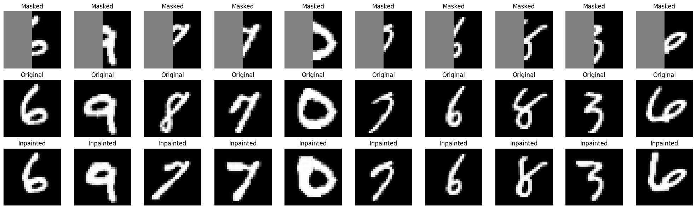

# Diffusion-Based Image Inpainting on Masked MNIST

This project demonstrates how diffusion models can be applied to the task of **image inpainting** on the MNIST dataset. Specifically, it focuses on reconstructing masked regions in grayscale digit images using a denoising diffusion probabilistic model (DDPM).

---

## Features

- **Custom Binary Masking Pipeline**  

- **Simple Denoising Diffusion Probabilistic Model (DDPM)**  
  
- **U-Net Architecture for Noise Prediction**  

- **Time Embedding for Diffusion Steps**  

- **Loss Function: Noise Prediction Objective**  

- **Training and Inpainting Visualization**  

- **Evaluation on Unseen Masked Digits**  

---

## Sample Results
|  |
|  |

